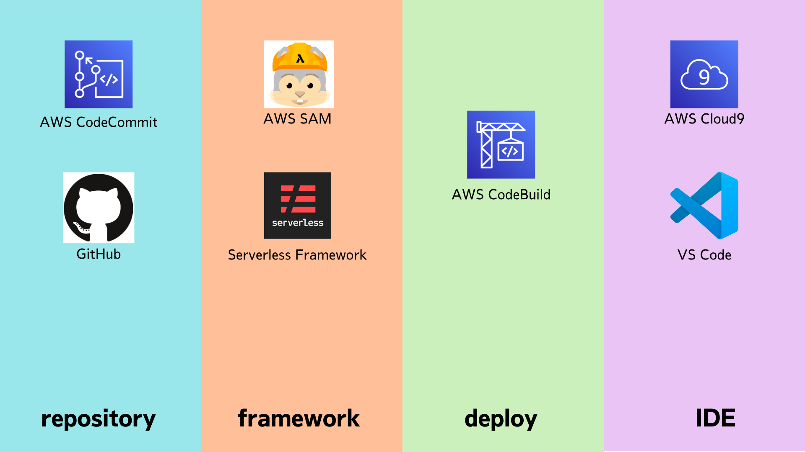

author: 三浦一樹
summary: 説明文
id: docs
categories: codelab,markdown
environments: Web
status: Draft
feedback link: https://github.com/miura-bd/lambda-ci-cd-handson/issues

# Lambda CI/CD ハンズオン

## はじめに

Duration: 0:05:00

### はじめに

#### 色々な選択肢



- repository
  - CodeCommit
  - GitHub
- framework
  - AWS SAM
  - serverless framework
- deploy
  - CodeBuild
- IDE
  - AWS Cloud9
  - Visual Studio Code

組み合わせは色々ありますが、今回は以下のものを使用します

- repository
  - CodeCommit
- framework
  - AWS SAM
- deploy
  - CodeBuild
- IDE
  - AWS Cloud9

Positive: 何かお知らせを書きたい時のボックス

Negative: 何か注意点などを書きたい時のボックス

## 今回構築するもの

Duration: 0:05:00

- AWS Lambda を構築します

## CodeCommit の準備

Duration: 0:05:00

<button>
 [CodeCommit](https://ap-northeast-1.console.aws.amazon.com/codesuite/codecommit/repositories?region=ap-northeast-1)
</button>

## Cloud9 の準備

Duration: 0:05:00

## Cloud9 での操作

### CodeCommit へのファーストコミットの作成

作成した CodeCommit リポジトリに対して、ファイルを追加してみましょう。

CodeCommit でHTTPS(GRC)をコピー

Cloud9 の画面下部にのターミナルにコピーして実行

```shell
git clone codecommit::ap-northeast-1://lambda-cdcd-hands-on
```

下ごしらえ
```shell
git config --global user.name "Your Name"
git config --global user.email you@example.com
```

レスポンス

```shell
Cloning into 'lambda-cdcd-hands-on'...
warning: You appear to have cloned an empty repository.
```

空のディレクトリがコピーされるので、そのディレクトリに移動します

```shell
cd lambda-cdcd-hands-on
```

試しに、AWS上の CodeCommit に追加するファイルを作成します

```shell
touch test.md
```

Cloud9 で 作成されたファイルに追記してみましょう

```markdown
# test
Lambda の CI/CD を作って見ましょう。
```

git のステージエリアにファイルを追加します

```shell
git add test.md
```

ステージに登録されているか、確認してみましょう

```shell
git status
```

レスポンス
```shell
On branch master

No commits yet

Changes to be committed:
  (use "git rm --cached <file>..." to unstage)
        new file:   test.md

```


変更したファイルを コミットします

```shell
git commit -m "ファーストコミット"
```

CodeCommit に追加します

```shell
git push
```

AWS コンソールで CodeCommit を開いて、ファイルが追加されていることを確認しましょう


### ユーザ設定


```shell
git config --global user.name <USER_NAME>
git config --global user.email <USER_EMAIL>

```

## AWS SAM の準備

Duration: 0:05:00

## AWS CodeBuild の準備

Duration: 0:05:00

## 複数環境の構築

Duration: 0:05:00

## お掃除

Duration: 0:05:00