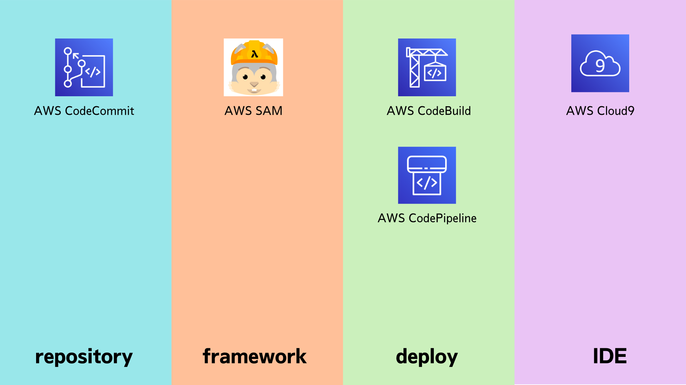
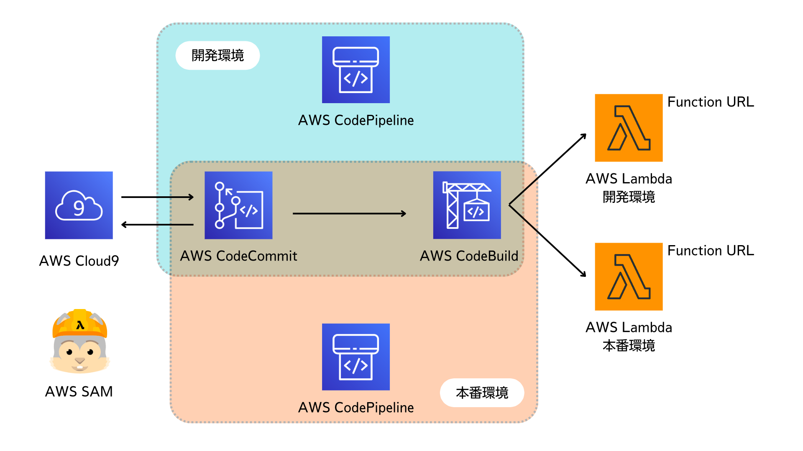

author: 三浦一樹
summary: 説明文
id: docs
categories: codelab,markdown
environments: Web
status: Draft
feedback link: https://github.com/miura-bd/lambda-ci-cd-handson/issues

# Lambda CI/CD ハンズオン

## はじめに

Duration: 0:05:00

### はじめに

#### 色々な選択肢



LambdaのCI/CDを構築するための方法は、様々ありますが、
今回は以下のものを使用します

- repository
  - CodeCommit
- framework
  - AWS SAM
- deploy
  - CodeBuild
  - CodePipeline
- IDE
  - AWS Cloud9


## 今回構築するもの

Duration: 0:05:00



- CodeCommit をリポジトリとして、ソースコードを管理します。
- CodeCommit のブランチで、開発環境と、本番環境を分けます
  - master ブランチは開発環境
  - PRODUCTION ブランチは本番環境
- Lambda 関数を AWS SAM を使用して定義します
- 開発環境と本番環境のどちらでも使用できる CodeBuild を作成します
- CodeCommit と CodeBuild を CodePipeline を使用して紐づけます
  - 開発環境用と本番環境用の2つのパイプラインを作成します
  - 1つの CodeBuild プロジェクトを使用して、CodePipeline で環境変数を上書きすることで、異なる環境のデプロイを実現します

### このハンズオンの諸注意

- 東京リージョン(ap-northeast-1)を利用します
- 指定がない限りはデフォルトのままで進めます。

## CodeCommit の準備

Duration: 0:05:00
### リポジトリの作成（コンソールから実施）

リポジトリ名を以下で作成

```console
lambda-cicd-hands-on
```

### HTTPS(GRC)でクローンするコマンドをコピー

また、後で使用します。

```console
git clone codecommit::ap-northeast-1://lambda-cicd-hands-on
```

<aside class="positive">
HTTPS(GRC) を使用するためには、python と git-remote-codecommit が必要ですが、今回使用する Cloud9 は最初から入っているので、そのまま使えます
</aside>

## Cloud9 の作成

Duration: 0:05:00


「Create environment」をクリック

Nameを以下で作成

```console
lambda-cicd-hands-on
```

## Cloud9 と CodeCommit の接続

### CodeCommit へのファーストコミットの作成

作成した CodeCommit リポジトリに対して、ファイルを追加してみましょう。

CodeCommit で、コピーしたHTTPS(GRC)を、Cloud9 の画面下部にのターミナルにコピーして実行

```console
git clone codecommit::ap-northeast-1://lambda-cicd-hands-on
```

レスポンス

```console
Cloning into 'lambda-cicd-hands-on'...
warning: You appear to have cloned an empty repository.
```

<!-- git のユーザを指定します。

```console
git config --global user.name "Your Name"
git config --global user.email you@example.com
```

上記を自分の名前とメールアドレスに書き換えて実行してください -->


空のディレクトリがコピーされるので、そのディレクトリに移動します

```console
cd lambda-cicd-hands-on
```

試しに、AWS上の CodeCommit に追加するファイルを作成します

```console
touch test.md
```

Cloud9で ```test.md``` ファイルを編集し、以下の内容をコピーして保存してください。

```markdown
# test
ちゃんとpushができるかテスト。
```

git のステージエリアにファイルを追加します

```console
git add test.md
```

ステージに登録されているか、確認してみましょう

```console
git status
```

レスポンス

```console
On branch master

No commits yet

Changes to be committed:
  (use "git rm --cached <file>..." to unstage)
        new file:   test.md

```


変更したファイルを コミットします

```console
git commit -m "ファーストコミット"
```

CodeCommit に追加します

```console
git push
```

AWS コンソールで CodeCommit を開いて、ファイルが追加されていることを確認しましょう

## Lambda の準備

Cloud9 に戻って、
Lambda 関数を定義するファイルを作成します

CodeCommit と関連づけられたディレクトリへに移動します

```console
 cd ~/environment/lambda-cicd-hands-on/
```

Gitと紐づいていると、ブランチ名（master) が表示される様になります。

```console
 (master) $ 
```

### Lambda 関数の定義

今回は node.js で定義された Lambda 関数を作成します。

以下のコマンドから、JavaScript ファイルを作成してください

```console
touch hello-lambda.js
```

Cloud9で ```hello-lambda.js``` ファイルを編集し、以下の内容をコピーして保存してください。


```JavaScript
exports.helloLambdaHandler = async () => {
    const message = 'Hello, Lambda!';

    console.info(`${message}`);
    
    return message;
}
```

先ほどど、同様の手順で、このファイルをCodeCommit に反映させましょう。


```console
git add hello-lambda.js
git commit -m "add: lambda ファイルの追加"
git push
```

CodeCommit の画面で、ファイルが追加されていることを確認してください。
（操作方法は省略）

## AWS SAM の準備

Duration: 0:05:00

Cloud9 には SAM CLI がプリインストールされているので、特に作業は必要ありません。

Cloud9 のコンソールで以下のコマンドを実行し確認してみましょう。

```console
sam --version
```

レスポンス

```console
SAM CLI, version 1.57.0
```

### SAM で使用する YAML ファイルの作成

```console
touch template.yaml
```

### YAML の内容

Cloud9で ```template.yaml``` ファイルを編集し、以下の内容をコピーして保存してください。

```yaml
AWSTemplateFormatVersion: 2010-09-09
Description: >-
  lambda-cicd-hands-on
Transform:
- AWS::Serverless-2016-10-31
Resources:
  helloLambdaFunction:
    Type: AWS::Serverless::Function
    Properties:
      Handler: hello-lambda.helloLambdaHandler
      Runtime: nodejs16.x
      Architectures:
        - x86_64
      MemorySize: 128
      Timeout: 100
      Description: A Lambda function that returns a static string.
      Policies:
        - AWSLambdaBasicExecutionRole
      FunctionUrlConfig:
        AuthType: NONE
Outputs:
  HelloLambdaFunction:
    Description: "Hello Lambda Function ARN"
    Value: !GetAtt helloLambdaFunction.Arn
  HelloLambdaFunctionUrl:
    Description: "Function URLs endpoint"
    Value: !GetAtt helloLambdaFunctionUrl.FunctionUrl
```

ここで、一旦 デプロイする前に、ローカル (Cloud9上)で実行してみましょう

```console
sam local invoke
```

Cloud9 上にコンテナが用意され、しばらく待つと実行結果が帰ってきます。

```console
Invoking hello-lambda.helloLambdaHandler (nodejs16.x)
Image was not found.
Removing rapid images for repo public.ecr.aws/sam/emulation-nodejs16.x
Building image.......................................................................................................................................
Skip pulling image and use local one: public.ecr.aws/sam/emulation-nodejs16.x:rapid-1.57.0-x86_64.

Mounting /home/ec2-user/environment/lambda-cicd-hands-on as /var/task:ro,delegated inside runtime container
2022-12-08T10:51:16.375Z        e1526a13-9113-4aee-8dfe-85a31b8e5159    INFO    Hello from Lambda!
END RequestId: e1526a13-9113-4aee-8dfe-85a31b8e5159
REPORT RequestId: e1526a13-9113-4aee-8dfe-85a31b8e5159  Init Duration: 1.45 ms  Duration: 284.76 ms     Billed Duration: 285 ms Memory Size: 128 MB     Max Memory Used: 128 MB
"Hello, Lambda!"
```


Cloud9 上のコンテナでLambdaが実行されました

```hello-lambda.js``` で定義した message が出力されていることが確認できます。

message の内容を変更して、再度実行すると、内容が変更されていることが分かります。

<aside class="positive">
このように、AWS SAM では、実際にデプロイをする前に、ローカルで簡単に動作確認をすることができます。
</aside>

作成した```template.yaml```　を CodeCommit に push します。

```console
git add template.yaml
git commit -m "add: SAM の テンプレートファイルの追加"
git push
```

## AWS SAM から deploy

必要な初期設定と合わせて、Lambda関数をデプロイしてみましょう

```console
sam deploy --guided
```

以下、対話形式でのプロンプトを通して、初期設定を行い、```samconfig.toml``` ファイルを作成します。

<aside class="negative">
1箇所だけ、Yを選択するところがあります。内容を確認しながら進めてください。
</aside>

```helloLambdaFunction Function Url may not have authorization defined, Is this okay? [y/N]```でのみ、「Y」を選択しますが、
その他は、デフォルトを使いますので、何も入力せず進めてください。

```console
Stack Name [sam-app]: 
AWS Region [ap-northeast-1]: 
#Shows you resources changes to be deployed and require a 'Y' to initiate deploy
Confirm changes before deploy [y/N]: 
#SAM needs permission to be able to create roles to connect to the resources in your template
Allow SAM CLI IAM role creation [Y/n]: 
#Preserves the state of previously provisioned resources when an operation fails
Disable rollback [y/N]: 
helloLambdaFunction Function Url may not have authorization defined, Is this okay? [y/N]: Y
Save arguments to configuration file [Y/n]: 
SAM configuration file [samconfig.toml]: 
SAM configuration environment [default]: 
```

しばらく待っていると、必要なリソースが生成されていきます。

以下のテキストが表示されたら、成功です。

```console
Successfully created/updated stack - sam-app in ap-northeast-1
```

この時、デプロイに必要な S3 バケットも同時に作成されています
```aws-sam-cli-managed-default-samclisourcebucket```
で始まる名前のバケットが作成されており、後ほど使用します。

その上に、今回生成した、Lambda Function Url のエンドポイントが表示されていますので、ブラウザで開いてみましょう。

ブラウザに、```Hello, Lambda!``` が表示されていたら成功です！

AWS SAM を使って、Lambda関数がデプロイされ、アクセスすることができました！

最後に、AWS SAM が生成してくれた```samconfig.toml``` を CodeCommit に push します。

```console
git add samconfig.toml
git commit -m "add: toml ファイルの追加"
git push
```

## AWS CodeBuild の準備

Duration: 0:05:00

### template.yaml の更新

複数環境に対応するために、```template.yaml``` ファイルを変更します。

以下を丸っとコピーして上書きしてください。

Parameters と　FunctionName の部分を追記してます。

```yaml
AWSTemplateFormatVersion: 2010-09-09
Description: >-
  lambda-cicd-hands-on
Transform:
- AWS::Serverless-2016-10-31
Parameters: # 追加部分
  Env: # prd: 本番、dev: 開発
    Type: String
    AllowedValues:
      - prd
      - dev
      - manual
    Default: manual

Resources:
  helloLambdaFunction:
    Type: AWS::Serverless::Function
    Properties:
      Handler: hello-lambda.helloLambdaHandler
      FunctionName:  # 追加部分
        !Join
          - ''
          - - 'hello-lambda'
            - '-'
            - !Ref Env
      Runtime: nodejs16.x
      Architectures:
        - x86_64
      MemorySize: 128
      Timeout: 100
      Description: A Lambda function that returns a static string.
      Policies:
        - AWSLambdaBasicExecutionRole
      FunctionUrlConfig:
        AuthType: NONE
Outputs:
  HelloLambdaFunctionUrl:
    Description: "Function URLs endpoint"
    Value: !GetAtt helloLambdaFunctionUrl.FunctionUrl
```

<aside class="negative">
この差分がちょっとわかりづらいかも？？
git diff 追加してみますか
</aside>

### buildspec.yml の作成

CodeBuild での実行を定義する buildspec.yml ファイルを作成します

```console
touch buildspec.yml
```

作成した buildspec.yml に以下の内容をコピーします

```yaml
version: 0.2

phases:
  build:
    commands:
      - aws cloudformation package --template-file template.yaml --s3-bucket $S3_BUCKET --output-template-file output.yml
      - aws cloudformation deploy --template-file output.yml --s3-bucket $S3_BUCKET --stack-name $STACKNAME --capabilities CAPABILITY_IAM --region $REGION --parameter-overrides Env=$ENV
      - aws cloudformation describe-stacks --stack-name $STACKNAME
```

<aside class="positive">
buildspec.yaml の中で＄から始まっているものは、CodeBuild プロジェクトの環境変数として、この後AWS コンソールから定義するものです。
</aside>

ここで定義したコマンドが、CodeBuild でビルドする時に実行されるコマンドなのですが、先ほどダメした、sam のコマンドが出てきません。

それは、CodeBuild が実行時に使用するコンテナには、AWS SAM がインストールされていないためです。

SAMで使用するテンプレートファイルは CloudFormation の拡張なので、AWS CLI での CloudFormation のオプションをそのまま使うことができます。

次は、変更したファイルをまとめて、CodeCommit へ push してみましょう。

```console
git add .
git commit -m "update: CodeBuild 対応"
git push
```

## AWS CodeBuild プロジェクトの作成

コンソールからの操作になります。

プロジェクトの作成をクリックします

### プロジェクトの設定

プロジェクト名に以下の文字列をコピーします

```console
lambda-cicd-hands-on
```

### ソース

ソースプロバイダで「CodeCommit」を選択

リポジトリで今回作成した「lambda-cicd-hands-on」を選択

リファレンスタイプはデフォルトのまま「ブランチ」を設定し

「master」ブランチを選択します。

### 環境

以下の様に設定します

| | |
|:-|:-|
| 環境イメージ | マネージド型イメージ |
| オペレーティングシステム| Amazon Linux 2 |
| ランタイム | Standard |
| イメージ | aws/codebuild/amazonlinux2-x86_64-standard:4.0 |
| 環境タイプ | Linux |
| 特権付与 | 選択しない |
| サービスロール | 新しいサービルロール　|
| ロール名　| そのまま　|

#### 追加設定

隠れている「追加設定」をクリックし、環境変数を4つ設定します

「環境変数の追加」をクリックすると行を増やすことができます。

ここで、AWS SAM が作成した S3 Bucket 名を使用します。
S3のコンソールから```aws-sam-cli-managed-default-samclisourcebucket```で検索し、バケット名をコピーしてください

| 名前 | 値 | タイプ |
|:-|:-|:-|
| S3_BUCKET | **上記検索結果** |プレーンテキスト |
| STACKNAME | sam-app | プレーンテキスト |
| REGION | ap-northeast-1 | プレーンテキスト |
| ENV | manual | プレーンテキスト |

あとはそのままで大丈夫です。

「ビルドプロジェクトを作成する」をクリックします。

プロジェクトが正常に作成されると、自動的に画面が変わるので、それまで待ちます。

完成したらビルドに必要なIAMを追加していきます。

### IAM Role にポリシーを追加

先ほど、プロジェクトの作成に合わせて作成した IAM ロールに、必要な IAM ポリシー を追加していきます。

AWS コンソールから、IAMを開いて、左のペインから「ロール」を選択
```codebuild-lambda-cicd-hands-on-service-role```
で検索してください

この IAM ロール に以下のものをアタッチしてください。

- IAMFullAccess
- AmazonS3FullAccess
- CloudWatchFullAccess
- AWSCloudFormationFullAccess
- AWSLambda_FullAccess

アタッチ後、IAMの画面は以下の様になります。


### ビルドの開始

AWS コンソールから、CodeBuild を開き、「ビルドを開始」ボタンを押下して実行をしてみましょう。

「フェーズ詳細」タブを開くと、進捗がわかります。

ステータスが成功になったら、完了です。

## CodePipeline の作成

コンソールから作成

AWS コンソールで CodePipeline を開きます。

「パイプラインの作成」をクリック

まずは、開発環境用のパイプラインを作成します。

### Step 1 パイプラインの設定を選択する

パイプライン名に以下をコピー。

開発環境用のパイプラインだとわかる様に、末尾に```-dev```を付けます。

```console
lambda-hands-on-dev
```

ロール名は自動的に以下となります。

```console
AWSCodePipelineServiceRole-ap-northeast-1-lambda-cicd-hands-on-dev
```

### Step 2 ソースステージを追加する

| | |
|:-|:-|
| ソースプロバイダー | AWS CodeCommit |
| リポジトリ名| lambda-cicd-hands-on |
| ブランチ名 | master |

### Step 3 ビルドステージを追加する

| | |
|:-|:-|
| プロバイダーを構築する | AWS CodeBuild |
| リージョン | アジアパシフィック（東京） |
| プロジェクト名 | lambda-cicd-hands-on |

先ほど、CodeBuild プロジェクトで設定した環境変数を、ここで一部上書きします。

この設定によって、同じプロジェクトを使用して、開発環境と本番環境を使い分けることができます。

| 名前 | 値 | タイプ |
|:-|:-|:-|
| STACKNAME | sam-app-dev | プレーンテキスト |
| ENV | dev | プレーンテキスト |

### Step 4 デプロイステージを追加する

スキップします。

### Step 5 レビュー

内容を確認して、「パイプラインを作成する」をクリック。

### パイプラインの実行

しばらく待つと、パイプラインが動き出します。

CodeBuild をクリックして、詳細を確認してみましょう。


<aside class="negative">
ビルドされたLambdaをに Function URLからアクセスする手順を追加
</aside>

## 複数環境の構築

Duration: 0:05:00

次に、本番環境用のリソースを作成していきましょう。


CodeCommit に本番環境ブランチを作成するため、Cloud9 に戻って、以下のコマンドを作成します。

```console
git branch PRODUCTION
```

新しく作成したブランチに checkout します

```console
git checkout PRODUCTION
```

CodeCommit に PRODUCTION ブランチを新規に追加します

```console
git push --set-upstream origin PRODUCTION
```

### CodePipeline をもう一つ作成します。

本番環境用のパイプラインを作成します。

### Step 1 パイプラインの設定を選択する


開発環境用のパイプラインだとわかる様に、末尾に```-prd```を付けます。

パイプライン名に以下をコピー。

```console
lambda-hands-on-prd
```

ロール名は自動的に以下となります。

```console
AWSCodePipelineServiceRole-ap-northeast-1-lambda-cicd-hands-on-prd
```

### Step 2 ソースステージを追加する

| | |
|:-|:-|
| ソースプロバイダー | AWS CodeCommit |
| リポジトリ名| lambda-cicd-hands-on |
| ブランチ名 | PRODUCTION |


### Step 3 ビルドステージを追加する

| | |
|:-|:-|
| プロバイダーを構築する | AWS CodeBuild |
| リージョン | アジアパシフィック（東京） |
| プロジェクト名 | lambda-cicd-hands-on |

先ほど、CodeBuild プロジェクトで設定した環境変数を、ここで一部上書きします。

この設定によって、同じプロジェクトを使用して、開発環境と本番環境を使い分けることができます。

| 名前 | 値 | タイプ |
|:-|:-|:-|
| STACKNAME | sam-app-prd | プレーンテキスト |
| ENV | prd | プレーンテキスト |

### Step 4 デプロイステージを追加する

スキップします。

### Step 5 レビュー

内容を確認して、「パイプラインを作成する」をクリック。

CodePipeline に本番環境用のパイプラインを作成します

AWS コンソールから、プルリクエストを作成します

AWS コンソールから、プルリクエストをマージします

<aside class="negative">
ビルドされた本番用のLambdaを Function URLからアクセスする手順を追加
</aside>

### featureブランチを作って、開発環境にマージ

<aside class="negative">
メッセージ部分を変更するfeatureブランチを作成し、master ブランチにマージして、開発と本番で違いを確認する
</aside>

## お掃除

Duration: 0:05:00

- CloudFormation で、以下のスタックを削除
  - sam-app
  - sam-app-dev
  - sam-app-prd
- S3 バケットを削除
- IAMもPipeline で作ったやつは残ってるはずなので、削除

<aside class="negative">
ここは、もう一回確認
</aside>